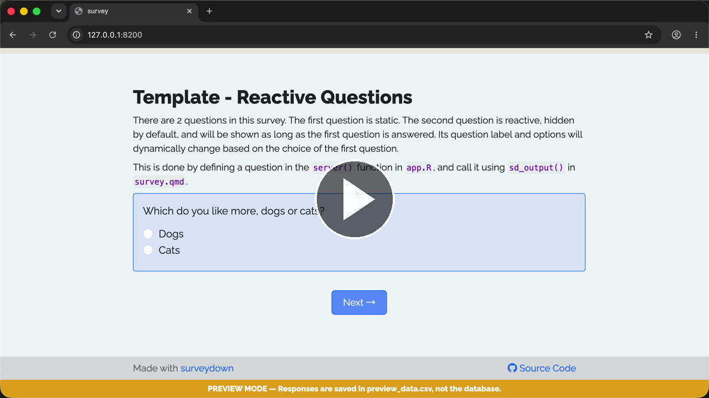

# Template - Reactive Questions

A template for creating reactive survey questions.

### See it in action

Watch the **Walkthrough recording:**

[](https://cdn.jsdelivr.net/gh/surveydown-dev/template_reactive_questions@main/video-recording.mp4)

### Create this template

Run this command in your R console:

```r
surveydown::sd_create_survey(
  #path = "path/to/survey",
  template = "reactive_questions"
)
```

### Learn more

- [Template page - Reactive Questions](https://surveydown.org/templates/reactive_questions)
- [Document page - Reactivity](https://surveydown.org/docs/reactivity.html)
- [Document page - Start with a template](https://surveydown.org/docs/getting-started#start-with-a-template)
